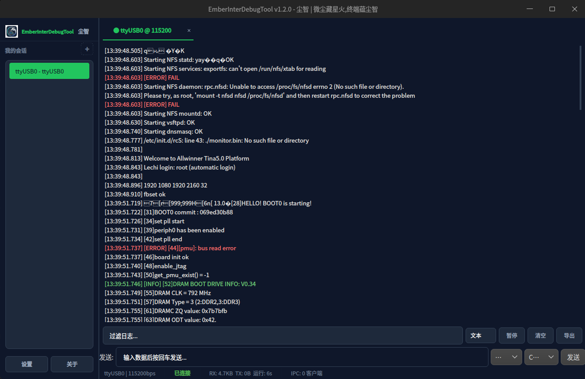

# QtSerialAssist

跨平台串口/网络调试助手，基于 Qt6 + QML 开发。

## 功能

- **串口调试**：波特率/数据位/校验位/流控设置，HEX/ASCII 收发，发送/接收数据方向标识
- **网络调试**：TCP 客户端/服务器、UDP 通信
- **Modbus**：RTU/ASCII/TCP 格式请求帧生成，CRC16/LRC 校验
- **快捷指令**：分组管理，支持批量发送，配置持久化为 JSON 文件
- **深色主题**：Deepin 风格深色/浅色双主题，支持跟随系统

## 运行截图



## 构建

### 依赖

- Qt 6.5+（Core、Gui、Network、Quick、QuickControls2）
- Qt SerialPort（可选，用于串口功能）

### Linux

```bash
sudo apt install qt6-base-dev libqt6serialport6-dev cmake g++
mkdir build && cd build
cmake .. -DCMAKE_BUILD_TYPE=Release
cmake --build . --parallel
./QtSerialAssist
```

### Windows

```powershell
mkdir build && cd build
cmake .. -DCMAKE_BUILD_TYPE=Release
cmake --build . --config Release --parallel
.\Release\QtSerialAssist.exe
```

### macOS

```bash
brew install qt@6
mkdir build && cd build
cmake .. -DCMAKE_BUILD_TYPE=Release
cmake --build . --parallel
open QtSerialAssist.app
```

## Linux 串口权限

默认情况下普通用户无权访问串口设备（`/dev/ttyUSB*`、`/dev/ttyS*`），请执行以下操作之一：

**方法一：加入 dialout 组（推荐）**

```bash
sudo usermod -a -G dialout $USER
# 注销后重新登录生效
```

**方法二：udev 规则（永久修改设备权限）**

```bash
sudo tee /etc/udev/rules.d/99-serial.rules << 'EOF'
KERNEL=="ttyUSB*", MODE="0666"
KERNEL=="ttyS*", MODE="0666"
EOF
sudo udevadm control --reload-rules
sudo udevadm trigger
```

## 快捷指令配置

`commands/` 目录下的 JSON 文件定义快捷指令分组，程序启动时自动加载，运行时可通过界面增删改。

```json
{
    "group": "分组名称",
    "commands": [
        {"name": "指令名称", "data": "指令数据\r\n"}
    ]
}
```

## 项目结构

| 文件/目录 | 说明 |
|-----------|------|
| `src/main.cpp` | 入口，QML 引擎初始化 |
| `src/backend/` | C++ 后端模块（AppCore、SerialPort、Network、DataProcessor 等） |
| `qml/main.qml` | 主窗口 QML |
| `qml/pages/` | 各面板 QML（LeftPanel、RightPanel、ModbusPanel、QuickCmdPanel） |
| `qml/components/` | 通用组件（DButton、DComboBox、DSwitch 等） |
| `qml/theme/` | Deepin 主题定义 |
| `CMakeLists.txt` | CMake 构建配置 |
| `commands/` | 快捷指令 JSON 配置 |

## 免责声明

本工具仅供开发调试、学习和研究使用。使用者应遵守当地法律法规，不得将其用于非法用途。因使用本工具造成的任何直接或间接损失，开发者不承担任何责任。

## 许可

MIT License
